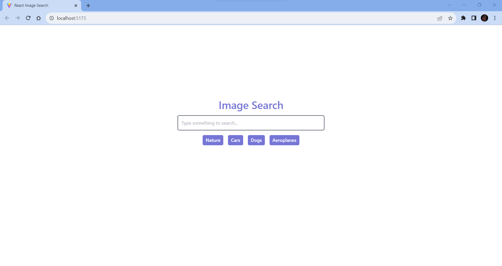
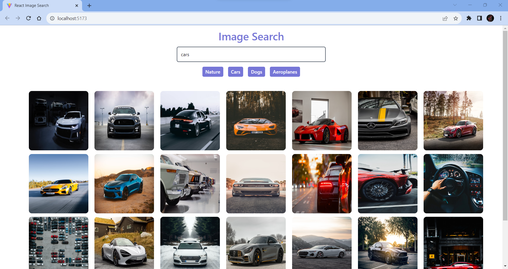
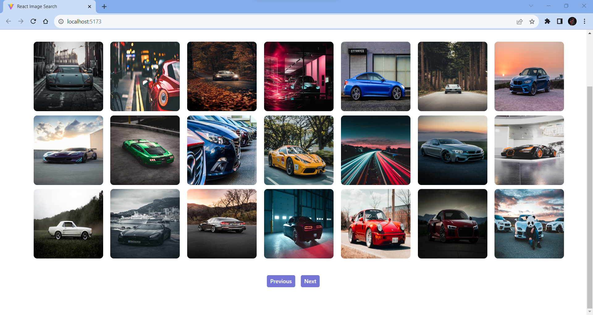

# React + Tailwind CSS - Image Search using Unsplash API

This is a basic image search application developed using React and Tailwind CSS. The Unsplash API has been used to search for images.

## Screenshots

